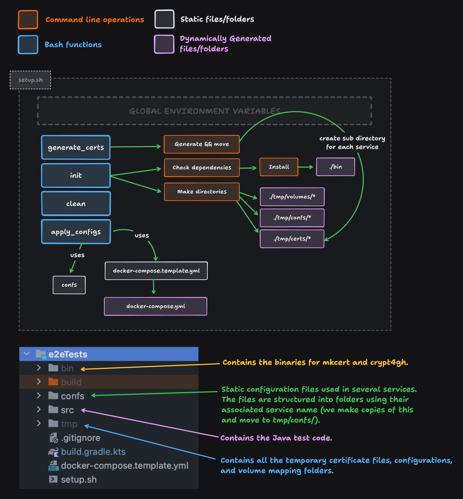

# E2E Test Setup (JUnit)

The original FEGA Norway end-to-end suite. It is **being retired** in favour of
the Go suite in [`../e2e`](../e2e), and is kept here so the two can be run
against the same stack until the Go one has proven itself.

This module now contains only the runner: the JUnit sources, its image and its
entrypoint. The stack itself (compose template, `confs/`, `scripts/`, `env.sh`)
lives once in `../e2e` and is shared by both suites, so any disagreement between
them is a test-suite difference rather than an environment difference.

## Running it

```sh
E2E_SUITE=java ./dev.sh start
```

`E2E_TESTS_INTEGRATION` picks the top-level class, as before: `FEGA` (default),
`GDI` or `EGA_DEV`.

To run the suite from the host instead of inside the stack, bring the stack up
as above, then:

```sh
source e2e/env.sh                       # with E2E_TESTS_RUNTIME=local exported
./gradlew :e2eTests:test
```

In CI, pushes run the Go suite. To run this one, use the Actions tab:
**Build and test** -> Run workflow -> `e2e_suite: java`.

## How the setup works



[Edit and export this figure at tldraw.com](https://www.tldraw.com/r/hQuNVXYht2-H6QRZcMh28?v=-3234,-969,4361,2023&p=page)
