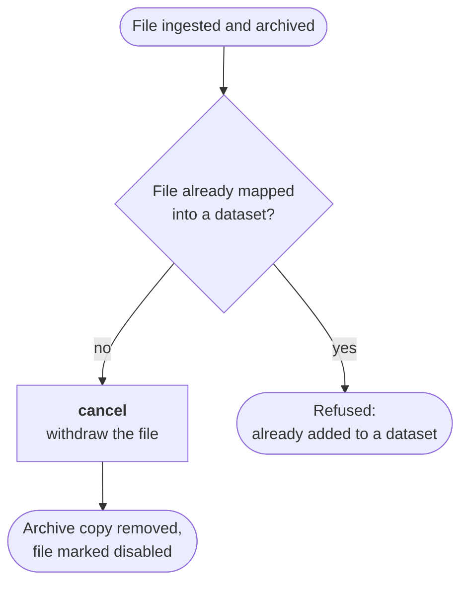

Ingestion can be undone, but only within a specific window and only from one place.

:::danger[The cutoff is mapping, not release]
Cancellation is refused as soon as the file **has been added to a dataset**. Since mapping
happens before release, the window closes at **mapping**, earlier than you might assume.
:::

## What cancel actually does

Cancelling removes the archived copy, removes the backup copy where one is configured, and marks
the file cancelled in the database. The later stages skip disabled files, so a cancelled file can
no longer be verified, finalized or mapped.

## Why mapping is the cutoff

Once a file belongs to a dataset, withdrawing it would leave that dataset inconsistent with what
it was declared to contain. The check is explicit: ingest refuses the operation with
*"cannot cancel file: already added to a dataset"*.

Because mapping precedes release, a dataset that has been released is necessarily past the
cutoff too. But release is not what closes the window; mapping is.

## Practical consequence

Map late, and only when you are confident about the contents. Everything before mapping is
recoverable through cancellation; nothing after it is.

:::note[Where cancellation is initiated]
Cancellation is a message type, not an endpoint with its own access control. The interceptor
routes any `cancel` message arriving on the Central EGA federated queue through to ingest, which
executes it. Nothing in this codebase restricts which system may emit that message.

The wiki stated that cancellation is possible **only from the Submission portal**. That may well
be true as a Central EGA operational fact, but it is not enforced anywhere in the code visible
from this repository, so treat it as a CEGA-side convention rather than a guarantee.
:::

:::note[Original source]
Redrawn from
[file ingestion cancel overview](https://www.tldraw.com/f/l4p-CV1Rkp_3nb5McUbNB?d=v-1918.-1883.4805.3162.6EUppOUSacNs9lF9ZkzPT).
:::
