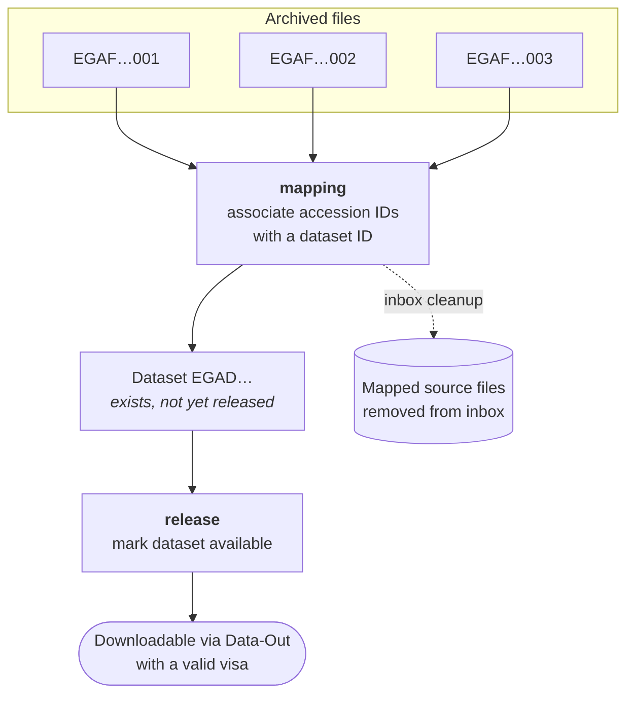

Individual archived files are not what people request access to. Access is granted at the level
of a **dataset**, which is a named collection of accession IDs. Two operations build and publish
one.

## Mapping

A mapping operation takes a list of accession IDs and a dataset ID and records the association.
The files must already have completed [ingestion](../ingestion/) and hold accession IDs; you
cannot map a file that has not been finalized.

Mapping has a side effect worth knowing about: **the mapper removes the mapped source files from
the inbox** after the mapping transaction commits. Once a file belongs to a dataset, the inbox
copy is redundant, and leaving it there would mean storing sensitive data twice. If you are
debugging and files have vanished from the inbox, a successful mapping is the usual reason.

It removes only the paths it actually mapped, and only where the submission location is known, so
this is not a general inbox sweep.

Mapping is also the point of no return for the [cancellation flow](../cancel/): once a file has
been added to a dataset, its ingestion can no longer be cancelled.

## Release

Releasing marks the dataset as available.

:::caution[Release gates the export path, not every path]
The released check is enforced when staging an export to the outbox: an unreleased dataset will
not stage. The Data-Out REST API does **not** check release; it authorises on visa and dataset
membership alone. So a visa naming a mapped-but-unreleased dataset can still retrieve files
through that API.

In practice the system relies on visas not being issued before release. Treat release as a
workflow gate rather than a hard technical barrier on every route.
:::

## Ordering

The sequence is strict, and each step depends on the previous one having completed:

1. Files ingested, verified, given an accession ID by Central EGA, and finalized
2. Files mapped to a dataset ID (inbox copies removed; cancellation window closes)
3. Dataset released (export staging becomes possible)

Mapping hard-fails for a file with no accession ID, so step 1 cannot be skipped.

:::note[Original source]
Redrawn from
[dataset ingestion operations overview](https://www.tldraw.com/f/_N9LeQDuAlprD3jaCbpZF?d=v-1841.-1360.4155.2734.6EUppOUSacNs9lF9ZkzPT).
:::
