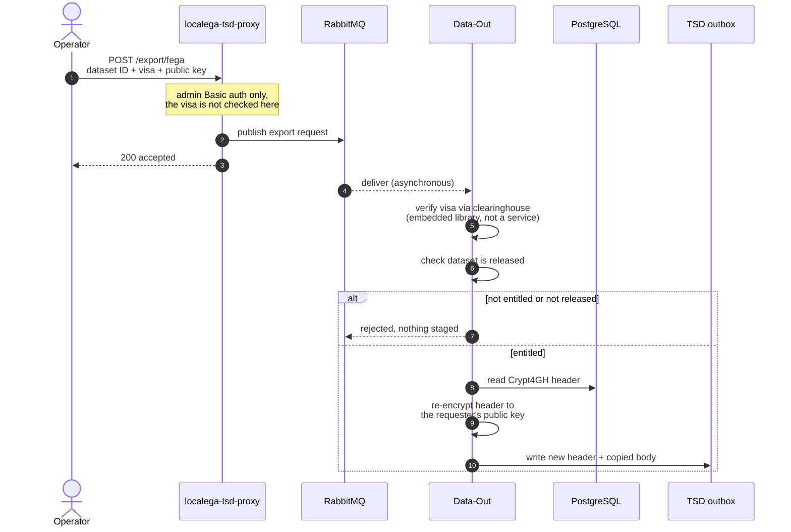
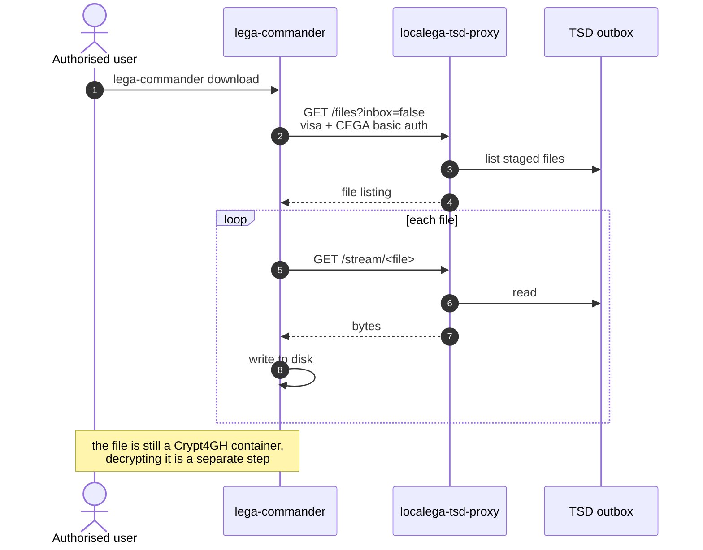

Getting data back out has two halves that are easy to conflate: an **asynchronous export** that
stages a per-recipient copy into an outbox, and a **download** that reads from that outbox.

## Export staging

An export is requested through the proxy's `/export/fega` endpoint. That endpoint is
**administrative**: it is protected by HTTP Basic auth with the `ADMIN` role, not by the end
user's visa. The proxy does not inspect the visa at all here; it packages the request and
publishes it, returning `200` immediately.

Three things about this are counter-intuitive:

**It is asynchronous.** There is no synchronous "staged / ready" reply. The proxy returns as soon
as the message is published. The requester discovers completion by polling the outbox listing.

**Entitlement is enforced in Data-Out, not the proxy.** The visa check and the released-dataset
check both happen after the message is consumed. A request that the requester is not entitled to
still returns `200` from the proxy and simply never produces a file.

**`clearinghouse` is a library, not a service.** It is embedded in both the proxy and Data-Out.
There is no network hop to it, so it will not appear in a trace or a service list.

### What re-encryption actually copies

Only the Crypt4GH **header** is rebuilt for the recipient; the encrypted body bytes are copied
through untouched, never re-encrypted.

That is a real saving in CPU, but not in storage or time:

:::caution
Staging writes a **full per-recipient copy** into the outbox, header plus the entire body. The
archive keeps one copy, but the outbox holds one per export, and export duration scales with file
size. An earlier version of this page claimed the opposite.
:::

## Download

`lega-commander` does **not** talk to Data-Out. It lists and downloads through the proxy, which
serves the TSD outbox that export populated.

:::caution[lega-commander does not decrypt or checksum]
The download is a straight copy to disk. `lega-commander` performs **no** checksum verification
and **no** decryption. Decrypting the retrieved container is a separate step with a Crypt4GH
tool, using the private key matching the public key supplied at export time.

The checksum verification described in the old wiki diagram exists only in the end-to-end test
suite, which asserts it as part of testing. It is not something the client does for you.
:::

### The other download path

Data-Out also exposes a REST API that serves dataset files directly against a Bearer visa,
re-evaluating entitlement on every call. In this system that path is exercised by the end-to-end
test suite rather than by `lega-commander`.

Worth knowing if you use it: **it serves plaintext by default.** A Crypt4GH container is returned
only when `destinationFormat=CRYPT4GH` is requested. No plaintext is written to server disk
either way, but on the default path plaintext does cross the wire.

:::note[Original sources]
Redrawn from
[dataset export staging](https://www.tldraw.com/f/431F88PTa-CDDZ_o9okix?d=v-944.-1215.2403.1581.6EUppOUSacNs9lF9ZkzPT)
and
[dataset download with lega-commander](https://www.tldraw.com/f/MHTaX5VTAgw-vnXOeH3rI?d=v-1566.-1444.4706.3097.6EUppOUSacNs9lF9ZkzPT),
then corrected against the proxy, Data-Out and `lega-commander` source.
:::
