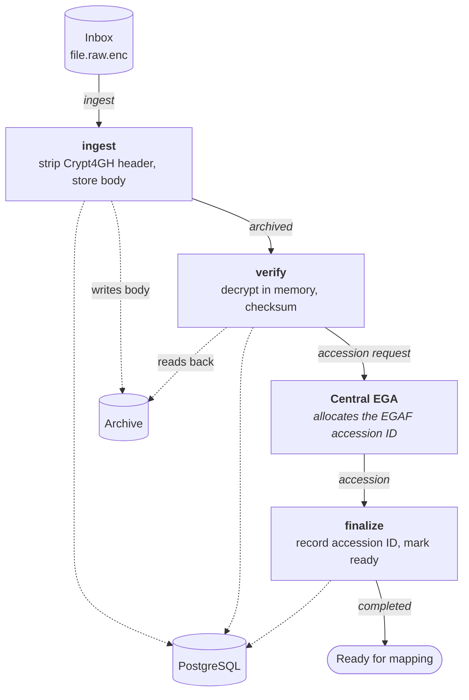

Once a file is in the inbox, ingestion moves it into the archive and gives it a permanent
accession ID. Every stage is a separate service, and they coordinate only through RabbitMQ and
PostgreSQL.

## Stage by stage

**`ingest`** picks up the trigger message, reads the file out of the inbox, separates the
Crypt4GH header from the encrypted body, and writes the body to the archive backend. The header
is kept separately in the database, because it holds the key material needed to re-encrypt the
file later for a different recipient.

**`verify`** re-reads what was archived, decrypts it in memory using the archive key, and
computes checksums over the decrypted content. This is the stage that proves the archived bytes
are intact and decryptable. It never writes plaintext anywhere: the decrypted stream is piped
straight into the MD5 and SHA-256 hashes and discarded. On success it publishes an **accession
request**, which leaves the local pipeline.

**Central EGA** allocates the permanent `EGAF…` accession ID and sends it back as an accession
message. The interceptor routes that message from the federated queue onto the local accession
queue.

**`finalize`** consumes that message, **records** the accession ID that Central EGA assigned, and
marks the file ready.

:::caution[Corrected: finalize does not mint the accession ID]
An earlier version of this page said finalize *assigns* the accession ID. It does not. The ID
arrives from Central EGA in the inbound accession message and finalize only persists it. This
matters if you are debugging a file stuck before mapping: the question is not "why did finalize
fail to generate an ID" but "did the accession message ever arrive".
:::

## Why it looks like this

The separation exists so a failure is both isolated and diagnosable. If `verify` fails, the
file is archived but never gains an accession ID, so it cannot leak into a dataset. If `ingest`
fails, nothing downstream ever runs.

It also means **there is no call stack to inspect when things go wrong**. A file stuck between
stages is diagnosed by looking at which message was published, which queue it landed in, and
what the database row says. Checking service logs in isolation will usually not tell you where
a file stopped.

:::note[Queue names]
Stage order and responsibilities on this page have been checked against the SDA service code.
Specific exchange names, routing keys and queue names are deliberately not listed, because they
are configuration rather than architecture and drift between deployments. Read the SDA config if
you need the exact wiring. The one arrow label worth trusting is `archived`, which is the real
default queue ingest publishes to.
:::

:::note[Original source]
Redrawn from
[file ingestion sub-process](https://www.tldraw.com/f/adN7lBg0G9GkugR6RaBFU?d=v-2102.-1421.4805.3162.6EUppOUSacNs9lF9ZkzPT).
:::
