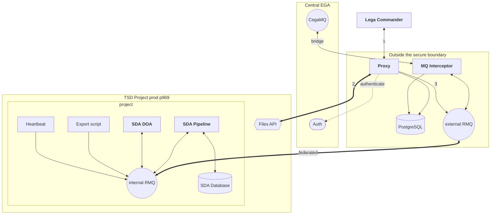

Nothing in the original wiki showed the whole system at once, so this page exists to give you
that picture before you read any of the individual flows.

Three parties cooperate, but they are not peers. **Central EGA** federates submissions and holds
the authoritative identity and accession records. **FEGA Norway** owns the front door: the proxy
and the MQ interceptor, both sitting outside the secure boundary. Everything else runs **inside a
TSD project** (`p969` in production): the whole SDA deployment, its database, its download API and
its own message broker.

That containment is the point. Sensitive data crosses the TSD boundary once, through the Files
API on upload, and only leaves again as a deliberate export.

## Two brokers, not one

This is the detail most likely to mislead you, and it is not obvious from the source code.

There are **two RabbitMQ instances joined by federation**:

- **`external RMQ`** sits outside the TSD project. The proxy publishes to it, and the MQ
  interceptor bridges it to Central EGA's `CegaMQ`.
- **`internal RMQ`** sits inside the project. The SDA pipeline, DOA, the heartbeat service and
  the export script speak only to this one.

Federation carries messages across the boundary. Nothing outside TSD connects directly to the
internal broker, and nothing inside reaches out to CegaMQ. So when a message "does not arrive",
the federation link is a distinct failure point from either broker.

The same split applies to state: the **PostgreSQL** the proxy and interceptor use is **not** the
**SDA Database** inside the project. Separate stores, separate lifecycles.

## The rules that explain most of the design

**Services never call each other.** Every stage of the pipeline communicates through RabbitMQ
messages and shared database state. `ingest` does not invoke `verify`; it publishes a message
saying a file was archived, and `verify` picks it up. This is why debugging a stuck pipeline
means reading queues and database rows, not stack traces.

**Files are encrypted before they move.** The submitter encrypts to Crypt4GH with a separate tool
before `lega-commander` is involved; `lega-commander` verifies the container and refuses anything
else. The proxy streams already-encrypted bytes, the archive stores the encrypted body, and
export rebuilds only the header for the recipient's key. No unencrypted submission sits on
server disk at any point.

**Everything reaches the user through the proxy.** `lega-commander` never talks to Data-Out
directly. Data-Out stages exports into the TSD outbox, and the proxy serves that outbox. The
Data-Out REST API does exist and is used by the end-to-end tests, but it is not the client path.

## What each layer is responsible for

| Layer | Where it runs | Responsibility |
| --- | --- | --- |
| Lega Commander | Submitter's machine | Upload and download through the proxy; validates the Crypt4GH container |
| Proxy | Outside TSD | Authenticating against CEGA Auth, streaming bytes through the Files API, serving the outbox |
| MQ Interceptor | Outside TSD | Bridging CegaMQ and `external RMQ` in both directions |
| PostgreSQL | Outside TSD | State for the proxy and interceptor. Not the SDA Database |
| Files API | TSD boundary | The only route for bytes into and out of the project |
| SDA Pipeline | Inside the project | Ingest, checksum verification, accession ID registration, dataset mapping |
| SDA Database | Inside the project | Archive state, file headers, dataset mappings |
| SDA DOA | Inside the project | Re-encrypting to the recipient and staging exports |
| Heartbeat Service | Inside the project | Liveness signalling over `internal RMQ` |
| Export script | Inside the project | Drives exports in production by publishing to `internal RMQ` |

## Where to go next

The flows on the following pages each zoom into one slice of this diagram:

- [Upload](../upload/): the left half, from `lega-commander` to the inbox
- [File ingestion](../ingestion/): the SDA pipeline in the middle
- [Dataset operations](../dataset-operations/): mapping files into datasets and releasing them
- [Cancelling an ingestion](../cancel/): undoing the above
- [Export and download](../export-download/): the right half, back out to the user
