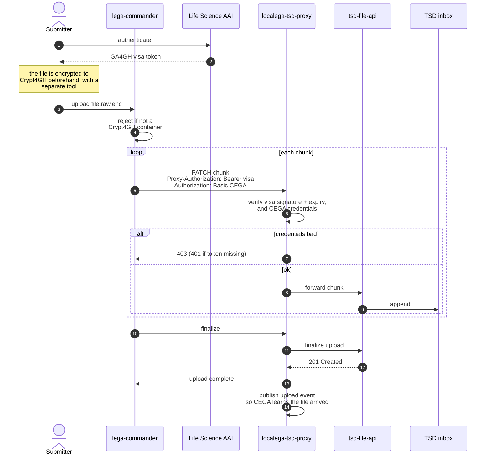

This is the path a submitted file takes from the researcher's machine into the TSD inbox. It is
the only route by which data enters the system.

## What matters here

**Two credentials are required, not one.** The submitter presents a GA4GH visa in a
`Proxy-Authorization: Bearer` header **and** CEGA credentials in a standard
`Authorization: Basic` header. Both are enforced. Diagrams that show only the visa are
incomplete, and a request carrying just the visa will not upload.

A bad or forged token is rejected with `403`; a **missing** token gives `401`.

**There is no upload session handshake.** The first `PATCH` both carries the first chunk and
initialises the resumable upload on the TSD side, returning the upload id. There is no separate
"request an upload slot" call, and every chunk request is independently authenticated, so
authentication is per-request rather than once at the front.

**The proxy is a pass-through, not a store.** It never writes the file to disk. One nuance: each
chunk is read fully into memory before being forwarded, so it streams at chunk granularity rather
than byte by byte.

**Encryption is not the client tool's job either.** `lega-commander` does **not** encrypt. It
verifies the file is already a Crypt4GH container and refuses it otherwise. Encryption happens
before `lega-commander` runs, with a separate Crypt4GH tool. The proxy could not decrypt the
stream even if it wanted to.

**Uploads are resumable.** The chunked `PATCH` protocol comes from the TSD file API, which means
an interrupted upload can continue rather than restart.

## After the upload

The file sits in the inbox: not archived, not downloadable.

Two things happen next, and it is worth separating them. On finalize the proxy **automatically
publishes an upload event**, which is how Central EGA learns the file arrived. But ingestion
itself does not start automatically; it waits for an explicit ingest message. That is covered in
[file ingestion](../ingestion/).

:::note[Original source]
Redrawn from the project whiteboard sketch,
[lega-commander interaction on upload](https://www.tldraw.com/f/UXC1rBem3Qiihyw-lAYTh?d=v-2112.-1203.4468.2646.6EUppOUSacNs9lF9ZkzPT).
:::
