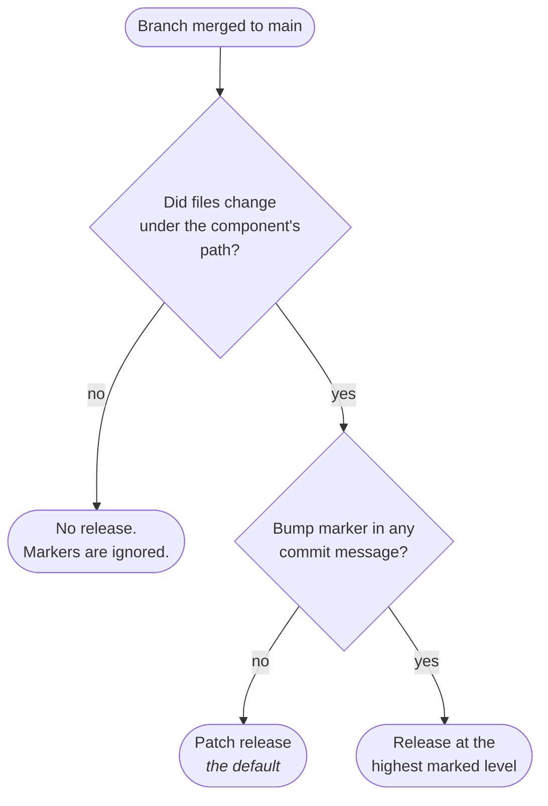

Every component in the monorepo is versioned and released independently. What gets released, and
at what level, is decided by two things: **which paths changed**, and **what your commit
messages say**.

Understanding this page is the difference between shipping the release you intended and shipping
a surprise.

## The two rules



**Rule one: no path change, no release.** A new tag is created for a component only when files
under that component's path actually changed.

One exception: **`FEGA-Norway` itself is in the release matrix unconditionally**, so it gets a
release on every merged pull request regardless of which paths changed. The path rule covers the
other eight components.

**Rule two: patch by default.** When a component changes, its patch version increments unless a
commit message explicitly asks for something else.

## Marker syntax

Add a marker to a commit subject line:

```
#major_componentName
#minor_componentName
#patch_componentName
```

For example:

```text
implement getVisa() #minor_clearinghouse
```

This bumps the **minor** version of `clearinghouse`. Any other component that changed in the
same branch still gets its default patch bump unless separately marked.

## Valid component names

A marker naming something that is not a real component fails CI. The recognised names are:

`lega-commander` · `clearinghouse` · `crypt4gh` · `tsd-file-api-client` · `cega-mock` ·
`localega-tsd-proxy` · `mq-interceptor` · `tsd-api-mock` · `FEGA-Norway`

The `check-commit-message` workflow validates every marker against this list on pull requests
targeting `main`, and fails on a typo.

:::caution[Put the marker in the subject line]
The validation reads commit **subjects** only. A marker in a commit body is neither validated nor
picked up, so it does nothing at all.
:::

:::note[`e2eTests` is not a release component]
Despite being a directory in the repo, `e2eTests` is absent from the component list and from the
changed-paths filter, so `#minor_e2eTests` **fails CI**. Its Go replacement, `e2e`, is
deliberately not a release component either.
:::

## Multiple components

**Across several commits in one branch:**

```text
update encryption #minor_crypt4gh
add new API endpoint #major_clearinghouse
```

**Or within a single commit:**

```text
upgrade to Java 25 #major_clearinghouse #major_crypt4gh
```

Both work. Markers are collected across the whole branch.

## Conflicting markers

If the same component is marked at different levels anywhere in the branch, **the highest level
wins**. This precedence comes from the pinned third-party tagging action rather than from
anything in this repository, so it is the action's documented behaviour rather than a rule the
repo enforces itself:

> major &gt; minor &gt; patch

So both of these produce a major bump for `clearinghouse`:

```text
refactor X #minor_clearinghouse #major_clearinghouse
```

```text
refactor X #minor_clearinghouse
upgrade X #major_clearinghouse
```

## Forgot a marker?

You have two options before merging.

### Amend, if it was your most recent commit

```bash
git commit --amend
```

Edit the message to include the marker, then push:

```bash
git push --force-with-lease
```

:::caution
Prefer `--force-with-lease` over `--force`. It refuses to overwrite work someone else pushed to
your branch in the meantime.
:::

### Add a commit, if you would rather not rewrite history

```text
add missing marker #minor_clearinghouse
```

The marker is picked up from any commit in the branch, so a commit that exists only to carry one
works fine.

## What actually happens on merge

The `publish-and-release` workflow runs after a pull request is merged into `main`. For every
changed component it publishes the new version, creates a GitHub Release, tags it, and generates
a changelog from the Conventional Commit subjects.

Publishing targets differ per artifact, which is easy to get wrong:

| Component | Published to |
| --- | --- |
| `crypt4gh`, `clearinghouse` | Maven Central, plus the GitHub registry |
| `tsd-file-api-client` | **GitHub Packages only**, not Maven Central |
| Docker images | GitHub Container Registry |
| `lega-commander` | Go binaries on the GitHub Release |

Before merge, `pre-release-check` runs on pull requests to catch a release that would break.

:::caution[It is not a pure dry run]
JAR publishing and the Go build are dry-run/snapshot, but **Docker images are genuinely built and
pushed** to the container registry, tagged with the PR number. `publish-and-release` later retags
that same image. So opening a PR does publish container images, which surprises people auditing
the registry.
:::
