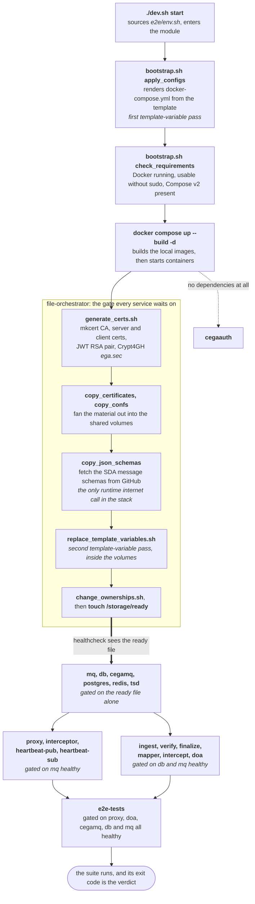

`dev.sh` lives in the repository root and automates the whole local environment. **You must run
it from the repository root.** Every path in it is relative to the current working directory, not
to the script: it sources `./e2e/env.sh` at load time, and each subcommand `cd`s into that
directory by name. Invoked from anywhere else it fails immediately.

Run it with no arguments for an interactive menu, or pass a subcommand directly.

:::note[This page documents the integration branch, ahead of main]
The e2e work described on this site, the `e2e/` module and stack, the Go runner and its
configuration, is landing through pull requests
[#833](https://github.com/ELIXIR-NO/FEGA-Norway/pull/833) (the Go runner and the module move),
[#834](https://github.com/ELIXIR-NO/FEGA-Norway/pull/834) (startup config validation) and
[#836](https://github.com/ELIXIR-NO/FEGA-Norway/pull/836) (proxy token unit tests). On `main`
the module still lives at `e2eTests/` with only the JUnit runner. The site documents the
integration state as current; the PRs carry the deltas back to `main`.
:::

## Starting and stopping

```bash
./dev.sh start   # build images, template configs, bring the stack up
./dev.sh stop    # tear down, removing volumes and networks
```

`start` does more than `docker compose up`. It renders the compose template, generates
certificates and keys, and waits for a bootstrap container to signal that shared volumes are
staged before the dependent services start.

## The boot chain

:::danger["Development environment started successfully" does not mean the tests passed]
`docker compose up -d` returns as soon as containers have **started**, not when they have
finished. `dev.sh` prints its success line at that moment, while `e2e-tests` is still running.
The message says nothing at all about the outcome of the suite.

To get the actual result, follow the container and then read its exit code:

```bash
docker logs -f e2e-tests
docker inspect --format='{{.State.ExitCode}}' e2e-tests
```

CI does exactly this. `build-and-test.yml` runs `./dev.sh start`, then a separate step polls
`{{.State.Running}}` until the container stops, dumps `docker logs e2e-tests`, and fails the job
on a non-zero `{{.State.ExitCode}}`. Locally you have to do it yourself.
:::

Five phases, from the shell to the test runner:



### Phase 1: on the host

`dev.sh` sources `e2e/env.sh` at load time, before any function runs. `start` then `cd`s
into `e2e` and sources it a second time, so the whole variable set is exported into the
environment that `bootstrap.sh` and `docker compose` inherit.

`bootstrap.sh apply_configs` copies `docker-compose.template.yml` to `docker-compose.yml`, scans
it for every `<<VAR>>` placeholder, and substitutes each one from the exported environment. Any
placeholder with no matching variable is reported as missing, along with the `export` line you
would need to add. The rendered `docker-compose.yml` is a generated file: edit the template, not
the output.

`bootstrap.sh check_requirements` then verifies that Docker is running, that the current user can
drive it without `sudo`, and that `docker compose` is available.

:::note[Two oddities, both harmless]
`check_requirements` is a precondition but runs *after* `apply_configs`, so a rendered compose
file is left behind even when Docker is not usable. And `env.sh` is sourced twice, once at script
load and once inside `start`. Neither causes a problem, but both look like bugs when you read the
script.
:::

### Phase 2: image builds

`docker compose up --build` builds six images. Their build contexts differ, which matters when
you are wondering why a change was not picked up:

| Image | Context | Why |
| --- | --- | --- |
| `tsd-api-mock`, `tsd-proxy` | repository root | Gradle needs the whole multi-project build |
| `mq-interceptor`, `cega-mock` | the service's own directory | self-contained Go services |
| `file-orchestrator` | `e2e/` | its scripts and confs live there |
| `e2e-tests` | repository root | the suite plus `cli/lega-commander` |

Everything else is pulled: RabbitMQ, PostgreSQL and Redis from Docker Hub, the SDA pipeline
services and Data-Out from `ghcr.io/neicnordic/sensitive-data-archive`, and the heartbeat image
from `ghcr.io/elixir-no`. The SDA and RabbitMQ tags are pinned to a version in the compose
template; the rest track `latest`.

### Phase 3: the file-orchestrator gate

Nothing except `cegaauth` starts until `file-orchestrator` is healthy, and its healthcheck is a
single test: does the file `/storage/ready` exist. That file is the last thing its entrypoint
does, after staging every certificate, configuration file and schema the rest of the stack mounts.

The entrypoint runs, in order:

1. `chmod -R 777 /volumes`
2. `generate_certs.sh`: installs an `mkcert` root CA, issues one server and one client
   certificate covering eight names (`localhost`, `db`, `vault`, `mq`, `tsd`, `proxy`, `cegamq`,
   `doa`), exports them to PKCS#12, generates a 4096-bit RSA pair for JWT signing, generates the
   Crypt4GH archive key `ega.sec`, and builds the truststore
3. `copy_certificates_to_dest.sh`: distributes that material to each service's volume, renamed to
   whatever that service expects
4. `copy_confs_to_dest.sh`: RabbitMQ, heartbeat, PostgreSQL, CEGA MQ and SDA configuration
5. `copy_json_schemas_to_dest.sh`: downloads the SDA message schemas
6. `replace_template_variables.sh`: the second substitution pass
7. `change_ownerships.sh`: sets the uid and gid each container expects, notably `65534` for the
   SDA services and `100:101` for RabbitMQ
8. `touch /storage/ready`, then `tail -f /dev/null` to stay alive

The steps are chained with `&&`, so **any failure stops the chain before the ready file is
written**. The container keeps running, its healthcheck never passes, and every dependent service
waits. A stack that appears to hang at startup is usually this: read `docker logs
file-orchestrator` first.

The healthcheck carries a 180-second start period, because certificate and Crypt4GH key
generation can run well past the default grace period under architecture emulation (an arm64
host running the amd64 image); without it the container is declared unhealthy at about 25
seconds and every dependent service aborts before the ready file ever appears.

:::caution[Step 5 is the only runtime internet dependency in the whole stack]
`copy_json_schemas_to_dest.sh` curls the GitHub contents API for the SDA federated message
schemas and downloads each one. It has no retry and no vendored copy in the repository, so on a
flaky network it is the first thing to fail.

The script checks the listing, the downloads and the resulting file count separately, and a
failure names the host it could not reach, so `docker logs file-orchestrator` points straight at
the network. (The `e2eTests/` copy on `main` still fails quietly: `curl` is unchecked there, the
`cp` that follows dies on an unmatched glob, and the chain stops with nothing pointing at the
network.)

```text
ERROR: could not list the SDA schemas from https://api.github.com/repos/neicnordic/sensitive-data-archive/contents/sda/schemas/federated
       the container needs outbound HTTPS to api.github.com
```

If the Docker daemon's container-to-internet path is the problem (see
[troubleshooting](../troubleshooting/#a-build-fails-resolving-dependencies)), Compose will merge a
`docker-compose.override.yml` placed next to the template, so you can route just that one
container around the bridge:

```text
services:
  file-orchestrator:
    network_mode: host
```

Host mode is safe for this container specifically: it only writes to mounted volumes and acts as
a health gate, and nothing connects to it over the network. Keep the file out of commits.
:::

:::note[Template variables are substituted twice]
The first pass, on the host, fills in the compose file. The second, in-container pass fills in
`definitions.json`, `rabbitmq.conf` and the SDA `config.yaml` *after* they have been copied into
the volumes. Both use the same `<<VAR>>` syntax and the same `env.sh` values, which is why a
missing variable can surface either as an unrendered compose file or as a service that starts and
then fails to read its own configuration.
:::

### Phase 4: services, in dependency order

Compose releases each service the moment its own conditions are met, so the tiers below overlap
rather than running strictly one after another:

- **`cegaauth`** declares no dependencies and starts immediately, in parallel with
  `file-orchestrator`.
- **`mq`, `db`, `cegamq`, `postgres`, `redis`, `tsd`** wait only for the ready file.
- **`proxy`, `interceptor`, `heartbeat-pub`, `heartbeat-sub`** additionally wait for `mq` to be
  healthy. `proxy` also wants `tsd`, `cegamq`, `postgres` and `redis` merely *started*, and
  `heartbeat-sub` wants `redis` started.
- **`ingest`, `verify`, `finalize`, `mapper`, `intercept`, `doa`** wait for both `db` and `mq` to
  be healthy. Because `db`'s healthcheck is `pg_isready`, this tier typically comes up after the
  previous one even though nothing orders them.
- **`e2e-tests`** waits for `proxy`, `doa`, `cegamq`, `db`, `mq` and `file-orchestrator` to all
  report healthy.

### Phase 5: the runner

`E2E_SUITE` (default `go`) picks which runner image the `e2e-tests` container builds; everything
below that container is shared, so both suites are measured against exactly the same stack. The
Go runner's entrypoint selects one binary from `E2E_ENV` (default `fega`) and executes it; the
binary reads the staged certificates directly off the volume, so there is no truststore import
step. What each environment targets and needs is covered in
[the e2e distributions](../e2e-distributions/).

The retiring JUnit runner (`E2E_SUITE=java ./dev.sh start`) instead imports the generated
`/storage/certs/rootCA.pem` into the JDK truststore with `keytool` and selects a test class from
`E2E_TESTS_INTEGRATION` (`FEGA`, the default, `GDI` or `EGA_DEV`). Its removal, and the
`E2E_SUITE` switch with it, is tracked in
[#851](https://github.com/ELIXIR-NO/FEGA-Norway/issues/851).

The container mounts the TSD inbox read-only, so the suite can assert that the mapper removed the
uploaded file. When the suite finishes the container exits, and its exit code is the result. See
the caution at the top of this section for how to read it.

## Rebuilding one thing

After changing a single module you rarely want a full rebuild. Each of these rebuilds and
redeploys just that piece:

```bash
# libraries
./dev.sh rebuild_clearinghouse
./dev.sh rebuild_tsd_file_api_client
./dev.sh rebuild_crypt4gh

# services
./dev.sh rebuild_and_deploy_proxy
./dev.sh rebuild_and_deploy_tsd
./dev.sh rebuild_and_deploy_mq_interceptor
./dev.sh rebuild_and_deploy_heartbeat_sub
./dev.sh rebuild_and_deploy_heartbeat_pub
```

## Everything else

| Command | What it does |
| --- | --- |
| `reexecute_tests_in_container` | Rebuild and re-run the end-to-end suite in its container |
| `apply_all_spotless_checks` | Format all Java and Kotlin sources |
| `restart_docker_daemon` | Restart the Docker daemon |
| `replace_root_ca` | Re-install the generated root CA into a container |
| `cleanup_environment` | Deep clean: remove all project containers, volumes and images |

## Formatting before you push

Formatting is enforced in CI by Spotless, so a badly formatted file fails the build. Either use
the `dev.sh` wrapper above or call Gradle directly:

```bash
./gradlew spotlessApply   # fix formatting
./gradlew spotlessCheck   # verify only
```

## Ports that must be free

The stack binds a number of host ports. If something else is already listening on one of them,
startup fails:

```
80    5005   5006   5432   5671   5673
6379  8088   8443   10443  15671  15672  25672
```

If you need different ports, remap them in the compose template rather than editing generated
files.

:::tip[Corrected from the old wiki]
The wiki listed `5432 5672 5433 80 5673 15672 25672`. That list both included ports the stack
does not publish (`5672`, `5433`) and omitted several it does (`8443`, `6379`, `10443`, `15671`,
`5005`, `5006`, `8088`). The list above was read from the compose template, whose port bindings
are identical on `main` and the integration branch.
:::

## When it goes wrong

See [troubleshooting](../troubleshooting/) for the failure modes you are most likely to hit.
