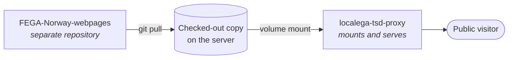

The public FEGA Norway website is **not** part of this monorepo. It is a set of static pages in
a separate repository:
[ELIXIR-NO/FEGA-Norway-webpages](https://github.com/ELIXIR-NO/FEGA-Norway-webpages).

## How it is served

A checked-out copy of that repository must exist in a directory that the `localega-tsd-proxy`
service mounts. The proxy serves the content from there.

That makes updating the live site straightforward: pull the latest changes in the mounted
directory and the proxy serves them. There is no build step and no deployment pipeline.

## Two things that will catch you out

:::danger[Block the .github directory]
Access to the `.github` folder inside the website directory **must be blocked** at nginx or an
equivalent layer. It is inside the checkout, so without an explicit rule it is served like any
other path.
:::

:::caution[The pages are static, but not standalone]
Despite being static, the site has a Life Science AAI login button wired into it. That depends
on configuration including redirect targets pointing at REST endpoints in the
`localega-tsd-proxy` service. Moving or renaming those endpoints breaks login on the public
site, which is easy to miss because nothing in this repository references the website.
:::
